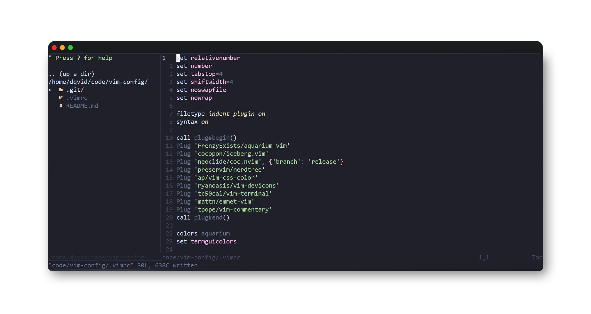

# Description

It's my vim config. In this config i use [Aquarium](https://github.com/FrenzyExists/aquarium-vim) as default & [Iceberg](https://github.com/cocopon/iceberg.vim) themes.
File manager in my config is [NerdTree](https://github.com/preservim/nerdTree). I also added [vim-devicons](https://github.com/ryanoasis/vim-devicons) so you need to have 'Nerd Fonts' installed to see file icons in file manager. There is [coc-nvim](https://github.com/neoclide/coc.nvim) in config, so you can connect autocompletion and refactoring to your editor. There is also [emmet](https://github.com/mattn/emmet-vim) & [vim-commentary](https://github.com/tpope/vim-commentary) to optimize your work in html css.

# Keymappings

### NerdTree

  nnoremap <C-n> :NERDTree<CR>
  nnoremap <C-t> :NERDTreeToggle<CR>
  nnoremap <C-f> :NERDTreeFocus<CR>

### coc-nvim

  inoremap <C-Space> <Esc>:CocAction<CR>
  nnoremap <C-Space> <Esc>:CocAction<CR>
